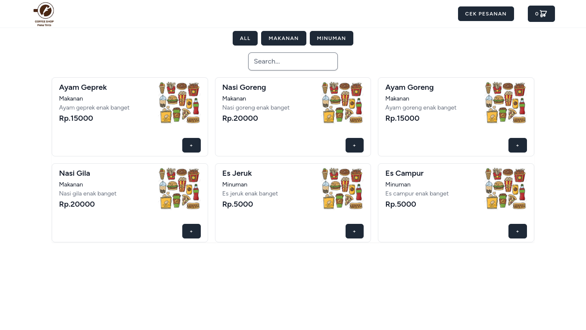
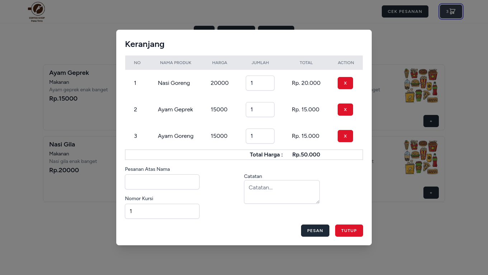
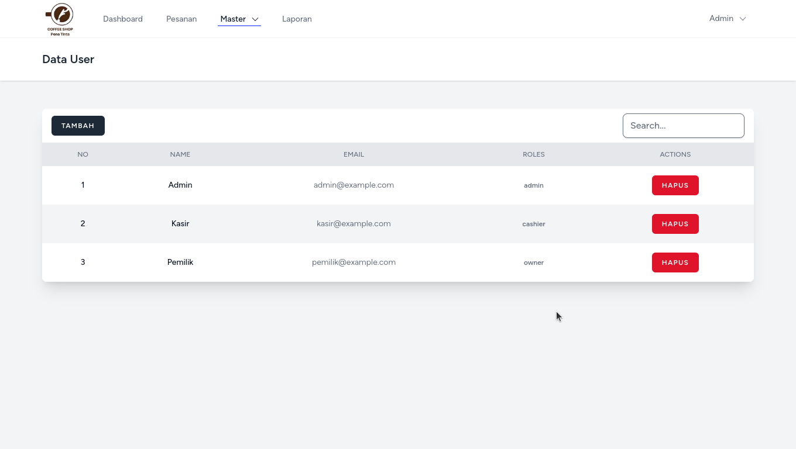
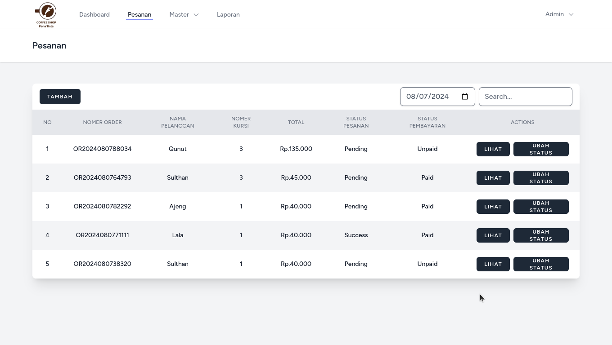
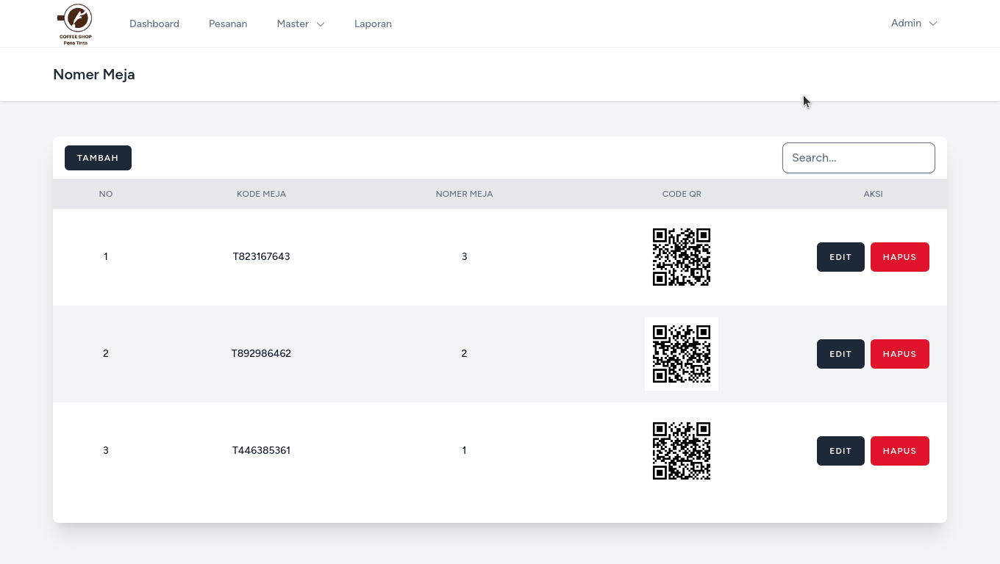
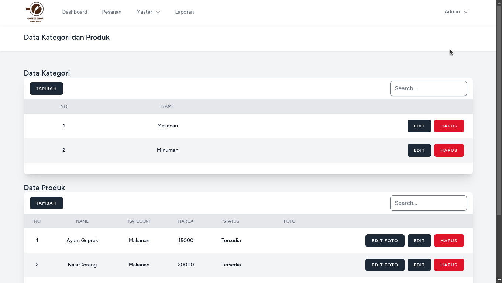
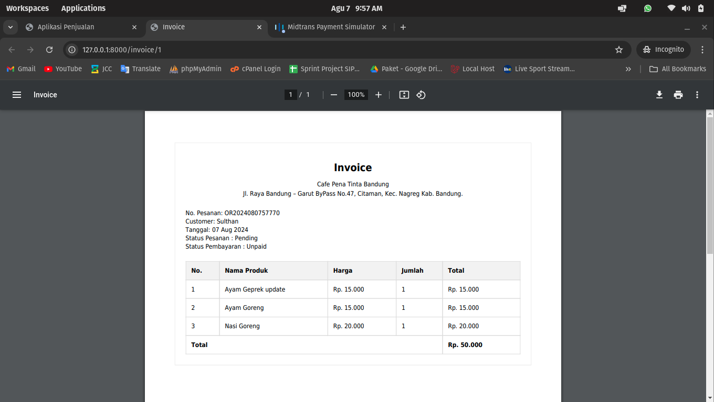

# Aplikasi Kasir

Aplikasi ini dibuat untuk menjunjang kinerja kasir.


## Alur Bisnis

- Pelanggan Scan QRCode yang berada di meja
- Pelanggan memesan menu
- Kasir menerima pesanan dan memperosesnya
- Pelayan mengantarkan pesanan
- pelanggan membayar ke kasir (next update payment gateway)


## Instalasi local

Clone the project

```bash
  git clone https://github.com/sulthanalif/aplikasi-penjualan
```

Go to the project directory

```bash
  cd aplikasi-penjualan
```

Install dependencies

```bash
  npm install

  composer install

  npm run build
```

Start the server

```bash
  php artisan serve
```


## liblary

 - [Laravel Jetstream](https://jetstream.laravel.com/introduction.html)
 - [Spatie](https://spatie.be/docs/laravel-permission/v6/installation-laravel)
 - [Livewire](https://livewire.laravel.com/)
 - [Laravel Excel](https://laravel-excel.com/)
 - [QR Code Generator - giauphan](https://github.com/giauphan/laravel-qr-code)


## Features

- Qr Code Generator
- Laporan Excel
- Multi Role


## Screenshots









